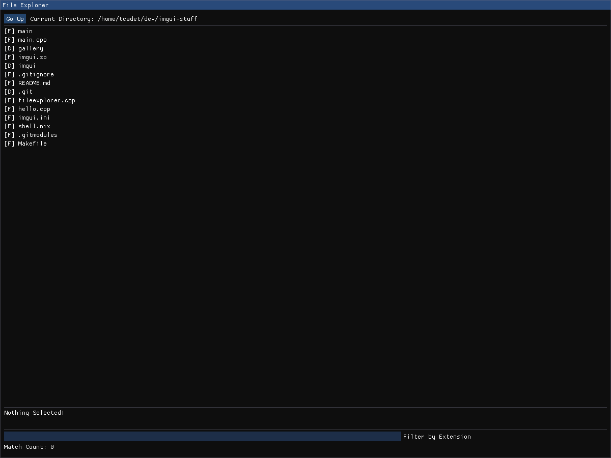

# ImGui stuff

Experiments related to ImGui

## Build

```shell
git submodule update --init
nix-shell
make
```

## Resources

https://github.com/franneck94/UdemyCppGui


## Gallery

### File Explorer


